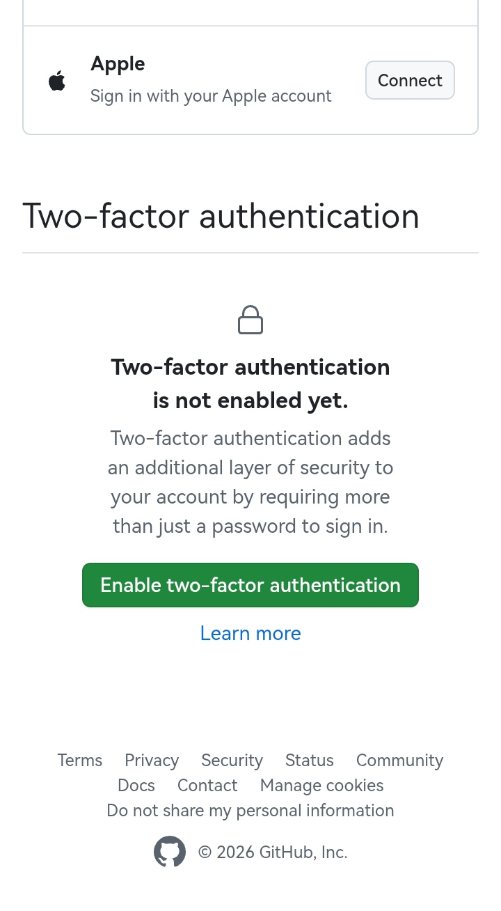
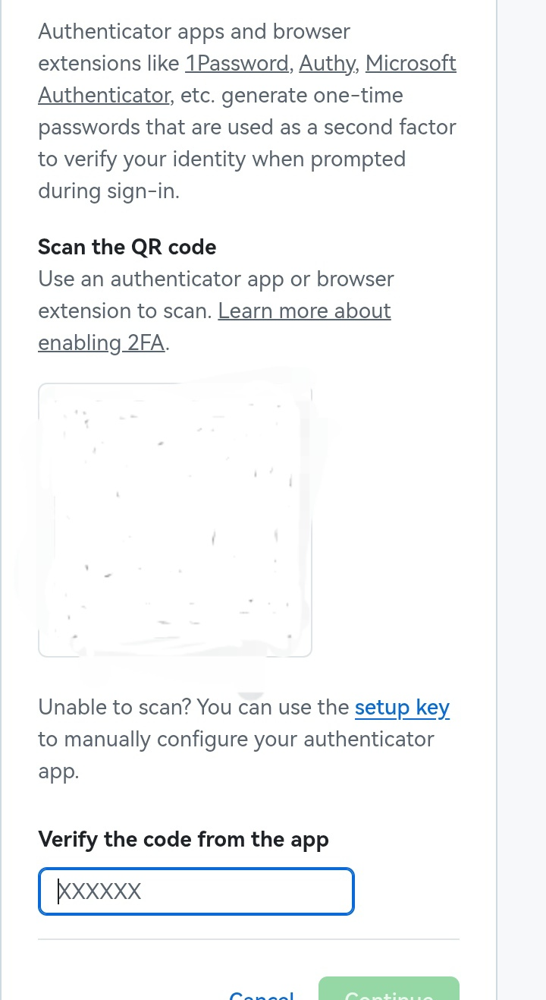

> [!note]- AI摘要
> 本文是一篇面向普通用户的 2FA 入门教程，以 GitHub 为例，手把手教你开启双重认证。文章先用大白话解释了什么是 2FA（密码 + 你手里有的东西），接着对比了几种常见认证方式：短信验证码、TOTP、硬件密钥和推送确认，最后重点推荐了 TOTP，理由是安全性高、不依赖短信、速度快。教程部分详细演示了如何用开源 App 2FAS 在 GitHub 上开启 2FA，并反复强调保存恢复代码的重要性。文章结尾提醒读者，2FA 并非绝对安全，仍需注意日常上网习惯。全文风格轻松口语化，附带表情标题，阅读门槛低，适合技术小白上手。作者还预告下一篇可能写 Astro 博客部署教程，随缘更新。

## ✍️写在前面

最近闲来无事，在翻Github的账号设置。翻到`Password and authentication（密码和身份验证）`时，看到了个`Two-factor authentication（双重认证）`，也就是2FA。一查才知道，这个东西对账号安全非常重要。也就是说，开启2FA，基本没人盗得了你的号:spoiler[包括你自己，但是不用担心，只要保存好恢复码，你还是能找回账号]

下面进入正题

> [!warning] 注意
> 本人非专业人士，本文内容全是个人理解，如有错误，欢迎指正

## 🤔介绍2FA

### 什么是2FA

> 双因子认证（2FA）是一种结合两种不同验证因素的身份认证方法，通常包括用户已知的密码（如账号密码）和用户持有的实物（如手机、令牌或生物特征）两类要素。其目的是通过双重验证提升账户安全性，主要应用于企业远程访问、金融及电子商务等领域。——[百度百科](https://baike.baidu.com/item/%E5%8F%8C%E5%9B%A0%E5%AD%90%E8%AE%A4%E8%AF%81%E6%9C%BA%E5%88%B6/9748125)

通俗地讲，其实就是你登录时要用两个东西：一个是**你的密码**，一个是**你手里有的东西**，例如`手机`、`令牌`等东西

### 常用的认证方式

常用的认证方式有这几种：

- **SMS OTP（短信验证码）**：没错，就是你经常输入的短信验证码
- **TOTP（基于时间的一次性密码）**：听起来很高大上，其实就是网站和你约定好一个暗号，各自用相同算法，结合当前时间，算出一个验证码，比对算出的结果，结果一样就放行
- **FIDO2（硬件安全密钥）**：使用实体设备通过一定方式连接网站进行认证
- **推送确认**：网站推送一个认证请求到手机APP上，在手机APP上确认
- 等等

这里主要介绍**TOTP**，也**推荐使用这个**

为什么？

好问题。

下面是简单的对比。

- **TOTP**：**安全性较高**，不依赖网站方的短信发送速度，**速度快且比较方便**。
- **短信**：虽然**方便**，但是手机信号差时，根本收不到:spoiler[虽然一般情况下能收到，但是到地下室或电梯就麻烦了]。这还是其次，主要是网站方**发送的短信不一定及时到**:spoiler[特别点名某度，经常是五分钟过去了，点了重发，上一个失效的验证码才到 ~~德铁行为（~~]，且安全性低。
- **FIDO2**：**最安全**，但是**又麻烦又贵**
- **推送确认**：这样还需要在手机**多安装APP**，浪费空间:spoiler[但是GitHub的挺好用的]

当然，如果你没有什么特别重要的东西，用短信就够了。但是，如果你想学习也可以，以备不时之需（假如某网站突然强制要求使用了呢）

下面是TOTP的使用教程

## 🔐2FA的开启与TOTP的使用

> [!tip] 你需要准备：
>
> - 脑子
> - 手
> - 手机或电脑
> - 网络

下面以**Github**的开启为例

### 1. 选择你的TOTP应用

这里建议使用**开源**的，这是因为开源的代码完全透明，一看就知道有没有后门。就算你看不懂代码，也会有大佬帮你看。

当然，不想那么麻烦，用**Google Authenticator**或**Microsoft Authenticator**也行。大厂产品，有保障。

我推荐**2FAS**，这个APP完全开源，界面也不错，支持导入导出，苹果安卓都有。[官网传送门](https://2fas.com/)

::github{repo="twofas/2fas-pass-android"}

::github{repo="twofas/2fas-pass-ios"}

进到对应仓库下载即可。iOS在AppStore下载。

### 2. 开启Github的2FA验证

看到这，我默认你有Github帐号了。

1. 打开[Github安全设置](https://github.com/settings/security)
2. 选择`Password and authentication`
3. 滑到最底部，你会看见这么个东西：

点击`Enable two-factor authentication`
4. Github会让你认证账号，按指示操作即可
5. 设置2FA密钥。点击2FAS右下角的加号，扫描二维码，复制生成的验证码，输入到github中。

6. 保存恢复代码。**务必妥善保管！丢了将无法找回！**建议抄纸上放抽屉，或者多复制几份到不联网设备上。
7. 完成！

以后登录Github时，只需输入密码，再简单地输入TOTP码即可。**现在你的账号很安全**了！

同理，其他的网站也可以这么操作（比如`Microsoft`）。

> [!WARNING] 警告
> **务必保存好恢复代码，但是不要泄露给其他人**，否则一旦丢失，你的账号永远回不来了！:spoiler[也不至于彻底找不回来，但是非常麻烦]

## 💬再说几句

**并不是开启了2FA，就可以高枕无忧了。毕竟2FA的TOTP不是没有风险的，比如有人监控了你的手机，那他就可以直接获取你的密钥。所以，还是要注意上网安全，不乱下软件，不泄露真实信息，这才是根本。**

## 🏁结尾

本文主要介绍了2FA，相信看到这里你一定有收获。总之，**没有身份验证方法是绝对安全的**。不过也不用怕，如果你只是普通用户，而且账号没什么重要的东西，那么用短信就够了，比纯密码好。如果你想保护你的账号，那就给你的账号加上2FA吧。

## 📅更新计划

打算下一篇写一下Astro博客的部署教程。随缘更新，可能会写写其他的。祝你生活愉快。