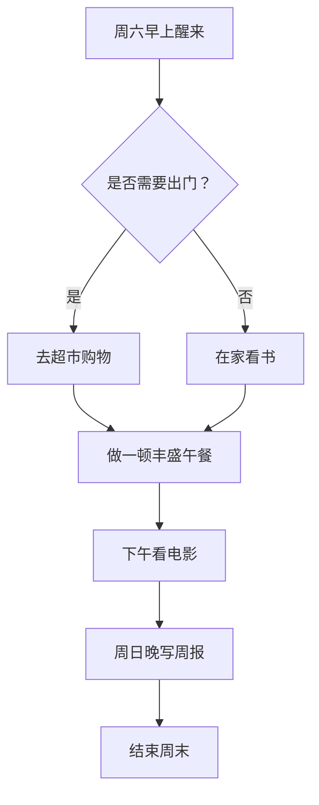
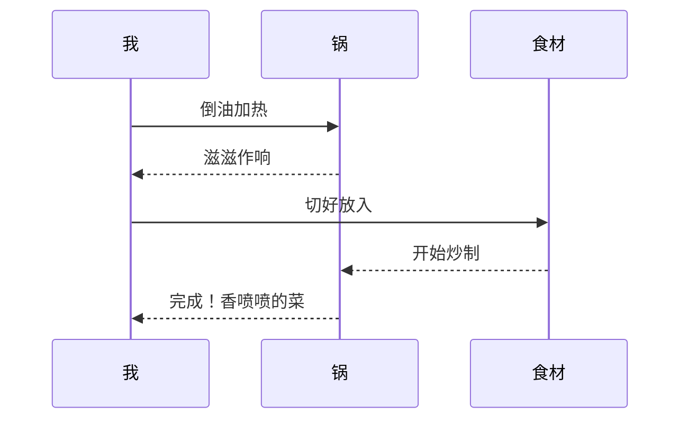
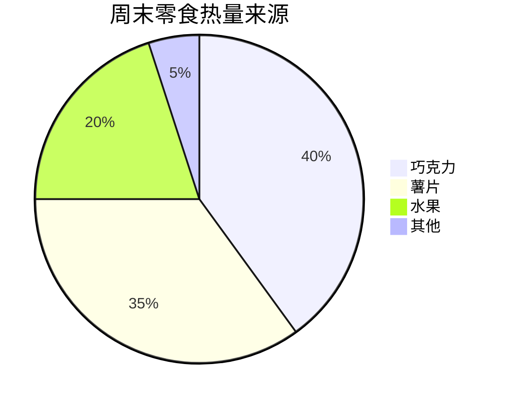

# 博客的第一篇文章！

以下是可用的语法尝试：

# 🌞 我的完美周末：效率与放松的平衡

欢迎来到我的周末记录！这篇文章会用到**数学公式**、**Mermaid图表**、**提醒框**以及一个隐藏的**剧透**。让我们开始吧。

## 1. 周末时间分配 (数学公式)

周末的时间管理很重要。我计划学习的时间占总时间的 **1/3**，用公式表示我的效率：

> 我的周末学习效率公式很简单：学习时间 $\frac{Learning\ Time}{Total\ Time} = \frac{1}{3}$

而整个周末心情的 **快乐积分** 可以用一个积分方程来概括：

$$
\int_{Saturday}^{Sunday} Happy(t) dt = \infty
$$

### 简单的预算矩阵

我为自己设计了一个简单的买菜预算矩阵（单位：元）：

$$
\begin{pmatrix}
蔬菜 & 30 
水果 & 50 
零食 & 20
\end{pmatrix}
$$

## 2. 周末计划流程图 (Mermaid 图表)

这是我这周末的安排，用 Mermaid 流程图来规划。



2.1 做饭的时序图 (我与厨房的关系)



2.2 项目完成的甘特图

这个周末我需要完成几个家务“项目”：

```mermaid
gantt
    title 周末家务项目计划
    dateFormat HH:mm
    axisFormat %H:%M
    section 清洁
    打扫客厅 :done, des1, 09:00, 1h
    洗衣服 :active, des2, 10:00, 2h
    section 休闲
    打游戏 :crit, after des2, 2h
    午睡 : 14:00, 1h
```



2.3 零食偏好饼图

我周末零食消费的分布：



3. 各种提醒和建议 (Admonitions)

以下是给过周末的大家的一些温馨提示。

[!NOTE] 提示
记得提前把闹钟关掉，睡到自然醒。

[!TIP] 建议
可以尝试在早上冥想10分钟，能有效提升一天的专注力。

[!IMPORTANT] 重要
出门前务必检查是否带了钥匙和手机，否则会很麻烦。

[!WARNING] 警告
如果一直刷手机，整个周末可能会在不知不觉中浪费掉！

[!CAUTION] 注意
吃太多零食可能会让你在周一感到疲惫，建议控制分量。

3.1 另一种风格的提醒框 (Docusaurus风格)

:::note
这里是一个普通笔记，提醒自己记得浇花。
:::

:::tip[你知道吗？]
周末多晒晒太阳可以补充维生素D。
:::

3.2 可折叠的提醒 (Python-Markdown风格)

??? note "点击展开我的秘密放松技巧"

1. 泡一杯热茶
2. 播放轻音乐
3. 躺在沙发上发呆

???+ warning "默认展开的警告"
即使是在假期，也尽量不要熬夜到凌晨3点，否则周一你会后悔的！

4. 嵌入一个喜欢的 GitHub 仓库

我最近在关注这个博客框架的项目：

::github{repo="MSQY-H/ljxh-blog-astro-firefly"}

5. 嵌入视频：这周末想看的视频

Bilibili 上的教程


6. 隐藏一个秘密 (剧透文本)

如果你坚持读到了这里，我要告诉你一个秘密：其实我周五下午就已经开始休息了 😜。

内容是 :spoiler[我已经提前完成了所有工作，所以这个周末是真正的无负担假期！]

7. MDX 高级用法 (需要 .mdx 文件)

注意：以下内容展示MDX语法，需要在 .mdx 文件中才能生效。这里仅作语法展示。

```mdx
import WeatherWidget from '../components/WeatherWidget.astro';

# 我的周末天气

今天的天气很好，下面是本周的天气小部件：

<WeatherWidget city="北京" />

{/* 使用变量 */}
export const weekendPlan = "看电影和睡觉";
我的周末计划是：**{weekendPlan}**。
```

结尾

恭喜博客搭建完成！欢迎大家！🎉🎉🎉